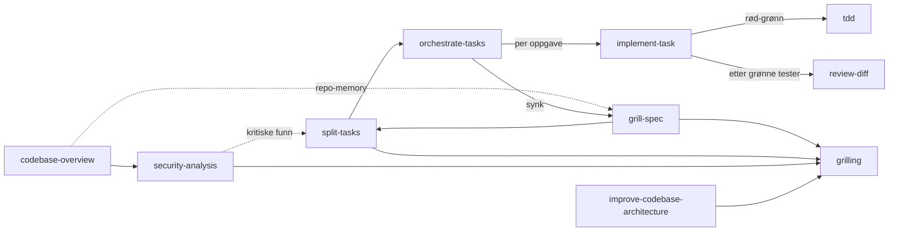

# Copilot-skills – personlige, deles fritt

<!-- Generert av KI med menneskelig supervensjon. Sist oppdatert: 2026-10-06 -->

Dette er mine personlige Copilot-skills. Du er velkommen til å bruke dem som
de er eller tilpasse dem til eget bruk.

> Mye av inspirasjonen til strukturen og tilnærmingen her er hentet fra
> [Matt Pocock sitt skills-repo](https://github.com/mattpocock/skills/tree/main/skills/engineering).

## Kom i gang

**Installer:** Kopier skillmappene du vil bruke til `~/.copilot/skills/`
(personlig) eller `.github/skills/` i prosjektet ditt.

**Bruk:** Åpne Copilot Chat i Agent-modus. Skillene deler seg i to grupper:

- **Brukerstyrt** (`grill-spec`, `split-tasks`, `orchestrate-tasks`,
  `codebase-overview`, `security-analysis`, `improve-codebase-architecture`):
  startes bare med skråstrek, f.eks. `/grill-spec`, `/codebase-overview`. De har
  `disable-model-invocation: true`, så modellen velger dem ikke selv – du
  velger fra skill-velgeren.
- **Modellstyrt** (`tdd`, `implement-task`, `review-diff`, `debugging`,
  `grilling`): kalles av andre skills eller trigges av frasen i
  `description`, f.eks. «run tdd», «implement the next task», «code review»,
  «debug». `grilling` kalles alltid av en annen skill, aldri direkte.
  Trenger ikke skråstrek.

## Scenario 1 – Ny på kodebasen

| Skill | Når brukes |
|-------|-----------|
| [`codebase-overview`](./codebase-overview/SKILL.md) | Du arver et prosjekt og trenger oversikt: språk, arkitektur, begreper, sårbarheter. Skriver/oppdaterer README og lagrer nøkkelfakta i `/memories/repo/codebase.md`. |
| [`security-analysis`](./security-analysis/SKILL.md) | Etter `codebase-overview`: arkitektonisk sikkerhetsgjennomgang med STRIDE, OWASP Top 10, NSM Sikker Livssyklus og personvern (GDPR / Datatilsynet) + light dependency-sjekk. Skriver prioritert tiltaksliste til `docs/security/SECURITY-ANALYSIS.md`. |

## Scenario 2 – Ny oppgave i kjent kodebase

Hele workflowen lever per oppgave i `docs/tasks/<task-id>/`, hvor
`<task-id>` er `<JIRA-NR>-<kort-navn>` (f.eks. `PROJ-123-electric-billing`)
eller bare `<kort-navn>` hvis det ikke finnes JIRA-nummer.

| Steg | Skill | Lager | Når brukes |
|------|-------|-------|-----------|
| 1 | [`grill-spec`](./grill-spec/SKILL.md) | `SPEC.md` | PO har gitt en ny oppgave. Griller utvikler til felles forståelse, skriver spesifikasjon med nøkkelbegreper og arkitekturavgjørelser. |
| 2 | [`split-tasks`](./split-tasks/SKILL.md) | `TASKS.md` | Spesifikasjonen er klar. Splitter i tracerkule-oppgaver (vertikale snitt) med kanban og avhengighetsdiagram. |
| 3 | [`orchestrate-tasks`](./orchestrate-tasks/SKILL.md) | (oppdaterer `TASKS.md`) | Oppgavene er klare og du vil kjøre flere etter hverandre. Løkke: velger neste oppgave, delegerer til `implement-task`, synker plan mot virkelighet. Resumerbar (Ralph-stil). |
| 3a | [`implement-task`](./implement-task/SKILL.md) | (kanban oppdatert) | Én oppgave om gangen: HITL-innsjekk, delegerer til `tdd`, selvverifiserer, kjører `review-diff`, oppdaterer kanban. Kan kalles alene eller av `orchestrate-tasks`. |
| 3b | [`tdd`](./tdd/SKILL.md) | (kode + tester) | Kalles av `implement-task` per oppgave. Rød-grønn-refaktor på ett vertikalt snitt. |
| 3c | [`review-diff`](./review-diff/SKILL.md) | (rapport til kaller) | Kalles av `implement-task` etter grønne tester. Gjennomgår diffen mot standarder og krav i to parallelle subagenter, i egen kontekst. |

## Scenario 3 – Noe er ødelagt

| Skill | Når brukes |
|-------|-----------|
| [`debugging`](./debugging/SKILL.md) | Noe kaster en feil, feiler eller er uventet tregt. Bygger en rød reproduksjonssløyfe før noen hypotese formuleres, minimerer, instrumenterer, fikser, og skriver regresjonstest. |

## Scenario 4 – Arkitekturen gjør endringer tunge

| Skill | Når brukes |
|-------|-----------|
| [`improve-codebase-architecture`](./improve-codebase-architecture/SKILL.md) | Ser etter grunne moduler som kan gjøres dype, med vekt på områdene som endres oftest i git-historikken. Leser `CONTEXT.md` og ADR-er i `docs/decisions/`. Skriver en HTML-rapport til temp-mappa, så du velger en kandidat og blir grillet gjennom den. |

## Flyt



## Filer per oppgave

```
docs/tasks/PROJ-123-electric-billing/
├── SPEC.md    ← grill-spec
└── TASKS.md   ← split-tasks (kanban, avhengigheter), oppdatert av
                 orchestrate-tasks/implement-task (avvik, AFK-batch, synk-historikk)
```

## Prinsipper

- **Engelsk gjennomgående** i description, instruksjoner og output
- **Én skill, ett ansvar** – sikkerhet bor i `security-analysis`, ikke spredt utover
- **Hver skill kort** (rundt 100–120 linjer) – store maler ligger som egne filer
- **Disjoint description-triggere** – `IKKE bruk når...` peker til riktig naboskill
- **Én eier av status** – kanban i `TASKS.md` eier oppgavestatus; andre filer
  speiler den ikke
- **Riktig tyngde** – små oppgaver kan gå rett fra mini-spec til `tdd`; full
  spec/splitt/orkestrer er for feature-størrelse
- **Selvverifisering alltid** – `implement-task` leser diff og kjører tester uansett HITL/AFK
- **Repo-memory er utgangspunkt, ikke fasit** – verifiser mot kode når den er gammel
- **Filer per hovedoppgave** – alt for én oppgave bor i samme mappe
- **KI-tag på alt som genereres** – `<!-- Generated by AI with human supervision. Last updated: [DATE] -->` (norsk variant i README)
- **Idempotent** – alle skills kan kjøres på nytt uten å duplisere eller miste arbeid
