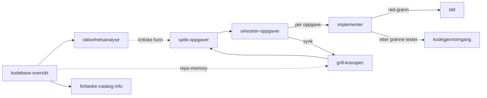

# Copilot-skills – personlige, deles fritt

<!-- Generert av KI med menneskelig supervensjon. Sist oppdatert: 2026-08-07 -->

Dette er mine personlige Copilot-skills. Du er velkommen til å bruke dem som
de er eller tilpasse dem til eget bruk.

> Mye av inspirasjonen til strukturen og tilnærmingen her er hentet fra
> [Matt Pocock sitt skills-repo](https://github.com/mattpocock/skills/tree/main/skills/engineering).

## Kom i gang

**Installer:** Kopier skillmappene du vil bruke til `~/.copilot/skills/`
(personlig) eller `.github/skills/` i prosjektet ditt.

**Bruk:** Åpne Copilot Chat i Agent-modus. Skillene deler seg i to grupper:

- **Brukerstyrt** (`grill-kravspec`, `splitt-oppgaver`, `orkestrer-oppgaver`,
  `kodebase-oversikt`, `sikkerhetsanalyse`, `forbedre-catalog-info`): startes
  bare med skråstrek, f.eks. `/grill-kravspec`, `/kodebase-oversikt`. De har
  `disable-model-invocation: true`, så modellen velger dem ikke selv – du
  velger fra skill-velgeren.
- **Modellstyrt** (`tdd`, `implementer`, `kodegjennomgang`, `feilsoking`):
  kalles av andre skills eller trigges av frasen i `description`, f.eks.
  «kjør tdd», «implementer neste oppgave», «feilsøk», «debug». Trenger ikke
  skråstrek.

## Scenario 1 – Ny på kodebasen

| Skill | Når brukes |
|-------|-----------|
| [`kodebase-oversikt`](./kodebase-oversikt/SKILL.md) | Du arver et prosjekt og trenger oversikt: språk, arkitektur, begreper, sårbarheter. Skriver/oppdaterer README og lagrer nøkkelfakta i `/memories/repo/`. |
| [`sikkerhetsanalyse`](./sikkerhetsanalyse/SKILL.md) | Etter `kodebase-oversikt`: arkitektonisk sikkerhetsgjennomgang med STRIDE, OWASP Top 10, NSM Sikker Livssyklus og personvern (GDPR / Datatilsynet) + light dependency-sjekk. Skriver prioritert tiltaksliste til `docs/sikkerhet/SIKKERHETSANALYSE.md`. |
| [`forbedre-catalog-info`](./forbedre-catalog-info/SKILL.md) | Validerer og oppdaterer `catalog-info.yaml` mot NVE-regler for Backstage. Brukes ved "sjekk catalog-info", "forbedre backstage-fil" eller lignende. |

## Scenario 2 – Ny oppgave i kjent kodebase

Hele workflowen lever per oppgave i `docs/oppgaver/<oppgave-id>/`, hvor
`<oppgave-id>` er `<JIRA-NR>-<kort-navn>` (f.eks. `PROJ-123-elektrisk-fakturering`)
eller bare `<kort-navn>` hvis det ikke finnes JIRA-nummer.

| Steg | Skill | Lager | Når brukes |
|------|-------|-------|-----------|
| 1 | [`grill-kravspec`](./grill-kravspec/SKILL.md) | `KRAVSPEC.md` | PO har gitt en ny oppgave. Griller utvikler til felles forståelse, skriver kravspec med nøkkelbegreper og arkitekturavgjørelser. |
| 2 | [`splitt-oppgaver`](./splitt-oppgaver/SKILL.md) | `OPPGAVER.md` | Kravspec er klar. Splitter i tracerkule-oppgaver (vertikale snitt) med kanban og avhengighetsdiagram. |
| 3 | [`orkestrer-oppgaver`](./orkestrer-oppgaver/SKILL.md) | (oppdaterer `OPPGAVER.md`) | Oppgavene er klare og du vil kjøre flere etter hverandre. Løkke: velger neste oppgave, delegerer til `implementer`, synker plan mot virkelighet. Resumerbar (Ralph-stil). |
| 3a | [`implementer`](./implementer/SKILL.md) | (kanban oppdatert) | Én oppgave om gangen: HITL-innsjekk, delegerer til `tdd`, selvverifiserer, kjører `kodegjennomgang`, oppdaterer kanban. Kan kalles alene eller av `orkestrer-oppgaver`. |
| 3b | [`tdd`](./tdd/SKILL.md) | (kode + tester) | Kalles av `implementer` per oppgave. Rød-grønn-refaktor på ett vertikalt snitt. |
| 3c | [`kodegjennomgang`](./kodegjennomgang/SKILL.md) | (rapport til kaller) | Kalles av `implementer` etter grønne tester. Gjennomgår diffen mot standarder og krav i to parallelle subagenter, i egen kontekst. |

## Scenario 3 – Noe er ødelagt

| Skill | Når brukes |
|-------|-----------|
| [`feilsoking`](./feilsoking/SKILL.md) | Noe kaster en feil, feiler eller er uventet tregt. Bygger en rød reproduksjonssløyfe før noen hypotese formuleres, minimerer, instrumenterer, fikser, og skriver regresjonstest. |

## Flyt



## Filer per oppgave

```
docs/oppgaver/PROJ-123-elektrisk-fakturering/
├── KRAVSPEC.md   ← grill-kravspec
└── OPPGAVER.md   ← splitt-oppgaver (kanban, avhengigheter), oppdatert av
                    orkestrer-oppgaver/implementer (avvik, AFK-batch, synk-historikk)
```

## Prinsipper

- **Norsk gjennomgående** i description, instruksjoner og output
- **Én skill, ett ansvar** – sikkerhet bor i `sikkerhetsanalyse`, ikke spredt utover
- **Hver skill kort** (rundt 100–120 linjer) – store maler ligger som egne filer
- **Disjoint description-triggere** – `IKKE bruk når...` peker til riktig naboskill
- **Én eier av status** – kanban i `OPPGAVER.md` eier oppgavestatus; andre filer
  speiler den ikke
- **Riktig tyngde** – små oppgaver kan gå rett fra mini-spec til `tdd`; full
  spec/splitt/orkestrer er for feature-størrelse
- **Selvverifisering alltid** – `implementer` leser diff og kjører tester uansett HITL/AFK
- **Repo-memory er utgangspunkt, ikke fasit** – verifiser mot kode når den er gammel
- **Filer per hovedoppgave** – alt for én oppgave bor i samme mappe
- **KI-tag på alt som genereres** – `<!-- Generert av KI med menneskelig supervensjon. Sist oppdatert: [DATO] -->`
- **Idempotent** – alle skills kan kjøres på nytt uten å duplisere eller miste arbeid
