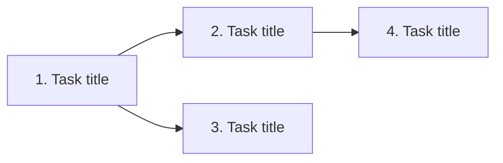

# Tasks template

<!-- Generated by AI with human supervision. Last updated: [DATE] -->

---

# Tasks: [Short title]

**Specification:** [SPEC.md](./SPEC.md)

## Dependency diagram

## Kanban

### Ready

#### 1. [Task title]

- **Type:** AFK
- **Blocked by:** none
- **Covers:** user story 1, 2
- **Start point:** _(set by implement-task)_

**What to build:** Short description of the vertical slice end to end.

**Acceptance criteria:**
- [ ] Criterion 1
- [ ] Criterion 2

---

#### 2. [Task title]

- **Type:** HITL
- **Blocked by:** #1
- **Covers:** user story 3
- **Start point:** _(set by implement-task)_

**What to build:** ...

**Acceptance criteria:**
- [ ] Criterion 1

---

### In progress

_Empty_

### Done

_Empty_

## Deviations from plan

Things that turned out different from what the spec or tasks assumed, found
by `implement-task` along the way. `orchestrate-tasks` reviews these in the
sync check and updates `SPEC.md` or `TASKS.md` as needed.

- ...

## AFK batch (not shown yet)

Finished AFK tasks waiting to be shown to the developer at the next stop.
Empty this when you reach a HITL task, the board is empty, or the developer
asks for a pause.

| Task | What was built | Tests added |
|------|----------------|-------------|
|      |                |             |

## Sync history

Each time the sync check has closed deviations into the spec or tasks, log it here.

| Date | Deviations closed | Files updated |
|------|-------------------|---------------|
|      |                   |               |