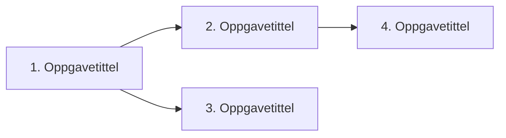

# Oppgaver-mal

<!-- Generert av KI med menneskelig supervensjon. Sist oppdatert: [DATO] -->

---

# Oppgaver: [Kort tittel]

**Kravspesifikasjon:** [KRAVSPEC.md](./KRAVSPEC.md)

## Avhengighetsdiagram

## Kanban

### Klar

#### 1. [Oppgavetittel]

- **Type:** AFK
- **Blokkert av:** ingen
- **Dekker:** brukerhistorie 1, 2

**Hva som skal bygges:** Kort beskrivelse av det vertikale snittet ende-til-ende.

**Akseptansekriterier:**
- [ ] Kriterium 1
- [ ] Kriterium 2

---

#### 2. [Oppgavetittel]

- **Type:** HITL
- **Blokkert av:** #1
- **Dekker:** brukerhistorie 3

**Hva som skal bygges:** ...

**Akseptansekriterier:**
- [ ] Kriterium 1

---

### Pågår

_Tom_

### Ferdig

_Tom_
