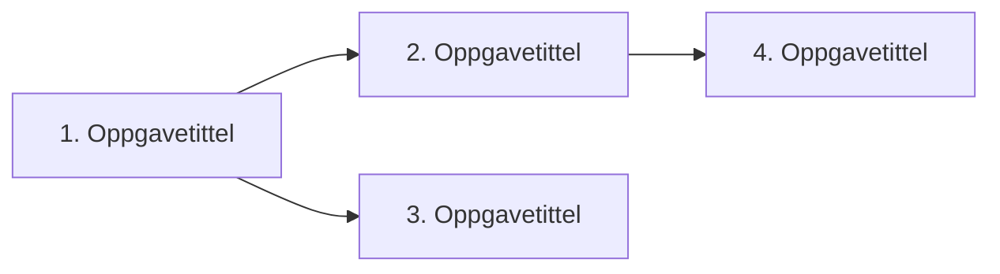

# Oppgaver-mal

<!-- Generert av KI med menneskelig supervensjon. Sist oppdatert: [DATO] -->

---

# Oppgaver: [Kort tittel]

**Kravspesifikasjon:** [KRAVSPEC.md](./KRAVSPEC.md)

## Avhengighetsdiagram

## Kanban

### Klar

#### 1. [Oppgavetittel]

- **Type:** AFK
- **Blokkert av:** ingen
- **Dekker:** brukerhistorie 1, 2
- **Startpunkt:** _(settes av implementer)_

**Hva som skal bygges:** Kort beskrivelse av det vertikale snittet ende-til-ende.

**Akseptansekriterier:**
- [ ] Kriterium 1
- [ ] Kriterium 2

---

#### 2. [Oppgavetittel]

- **Type:** HITL
- **Blokkert av:** #1
- **Dekker:** brukerhistorie 3
- **Startpunkt:** _(settes av implementer)_

**Hva som skal bygges:** ...

**Akseptansekriterier:**
- [ ] Kriterium 1

---

### Pågår

_Tom_

### Ferdig

_Tom_

## Avvik fra plan

Ting som ble annerledes enn kravspec/oppgaver antok, oppdaget av `implementer`
underveis. `orkestrer-oppgaver` vurderer disse i synk-sjekken og oppdaterer
`KRAVSPEC.md`/`OPPGAVER.md` ved behov.

- ...

## AFK-batch (ikke vist ennå)

Ferdige AFK-oppgaver som venter på å tømmes til utvikler ved neste stopp. Tøm
denne når du treffer en HITL-oppgave, brettet er tomt, eller utvikler ber om
pause.

| Oppgave | Hva som ble bygget | Tester lagt til |
|---------|--------------------|-----------------|
|         |                    |                 |

## Synk-historikk

Hver gang synk-sjekken har lukket avvik inn i kravspec/oppgaver, logg det her.

| Dato | Avvik som ble lukket | Oppdaterte filer |
|------|---------------------|------------------|
|      |                     |                  |
